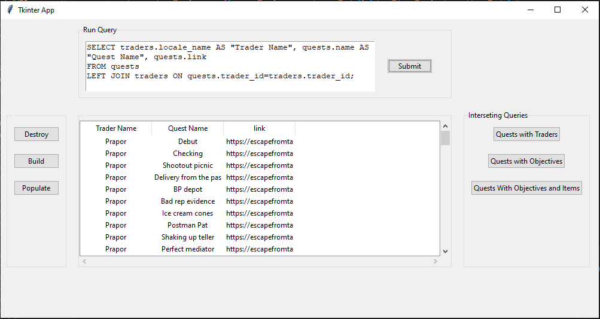
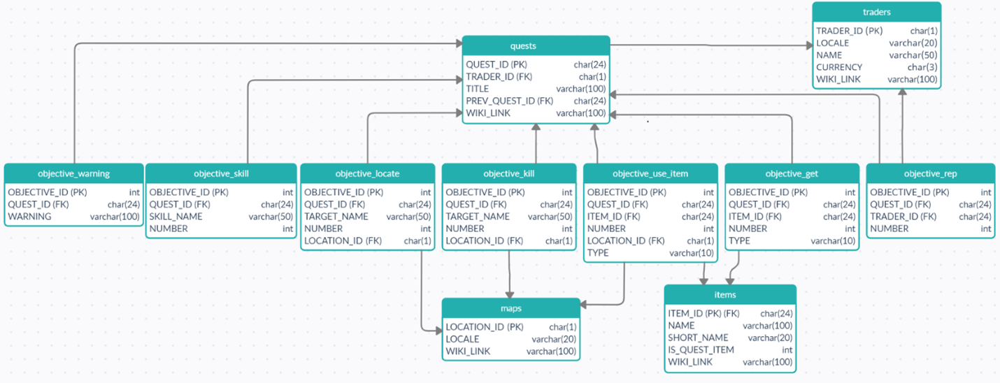

# Takov DB

## Disclamer
This was a project for my UMBC CMSC 461 Database Management Systems Class where I showed my knowledge about database design and SQL by creating a simple SQL database with a user interface application to interact with the database.

The data to populate the database came from https://github.com/TarkovTracker/tarkovdata on March 28th 2022 mostlikely the linked repository has been updated so this application will likely not keep up with changes. The folder `tarkovdata-master` contains a copy of the repository during March 28th 2022.

### Database Diagram

## Project Description
This is a simple python app that provides an interface to populate and query a
database containing data from the game Escape from Tarkov

This project uses a docker mariadb image that can be accessed with the python scripts

## How to setup
To run this you must have [Python](https://www.python.org/downloads/), 
[Docker](https://www.docker.com/products/docker-desktop/), 
[MariaDB](https://mariadb.com/downloads/community/),
and [MariaDB Python Connector](https://mariadb.com/downloads/connectors/connectors-data-access/python-connector) installed on your system

Also buildDB requires [The JSON files](https://github.com/TarkovTracker/tarkovdata) to populate the database in case this data is no longer available `data-dump.sql` contains the whole database at the time of creating this project

First a MariaDB database must be started to do so in the command prompt run:

`docker run -p 3306:3306 -d --name mariadb -eMARIADB_ROOT_PASSWORD=Password123! mariadb/server:10.4`

The `port` and `password` can be changed if needed but any changes must also be changed in config.py
so the Python connector can access the database

Then you must connect to the instance to create the tarkovdata database this can be done running the lines:

`mariadb --host 127.0.0.1 -P 3306 --user root -pPassword123!`

`CREATE DATABASE tarkovdata;`

Next make sure all the required packages are installed by running the command

`pip install -r requirements.txt`
<!--`pip freeze > requirements.txt`-->
<!--`mysqldump -u root -p tarkovdata > data-dump.sql` -->
Now that everything is done you simply have to run the app by moving to the directory it is in and running:

`python3 tarkovDBApp.py`
